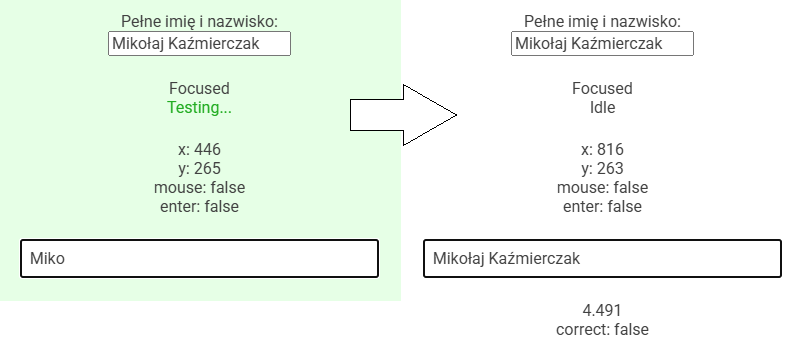

# KLM Test

Crude, but functional web app to test the user with KLM methodology. The user needs to write down his full name and the app will show the time it took to complete the task and whether an error was made.

This was a task for a course on usability testing. The collected data was later used for a report.

## Run

`npm i` then `npm run build` and `npm run start`

## Dev

`npm i` then `npm run dev`

Import aliases configurable in `rollup.config.js`:

- `$src` /src
- `$c` /src/Components
